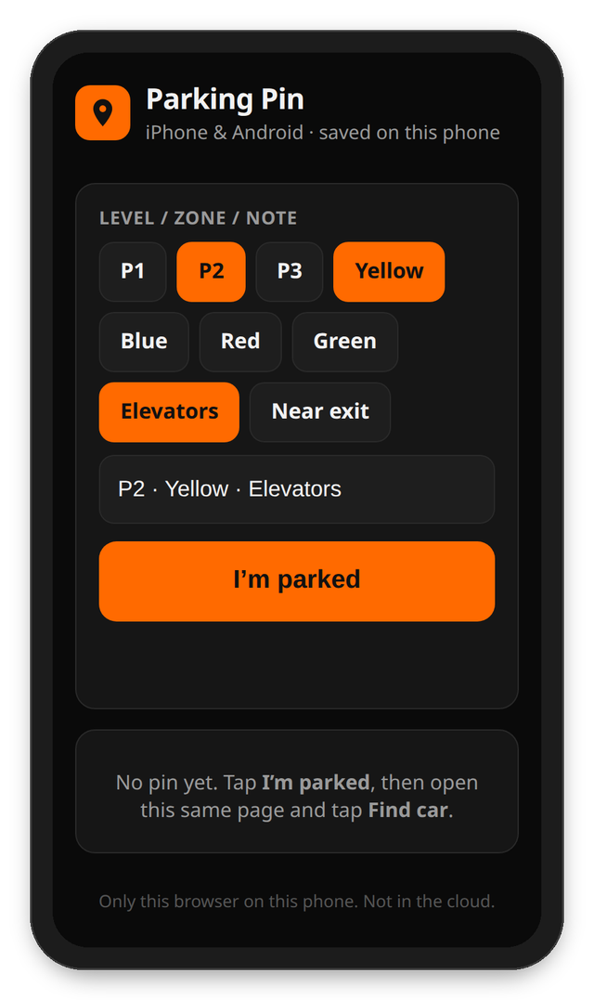

# Parking Pin



Save where you parked, then open Maps back to the car. Works on **iPhone and Android** in any modern mobile browser that can share GPS. No account.

**Open this first:** https://fambeho75.github.io/parking-pin/

That GitHub Pages address is HTTPS, which phones require before they will share location. A plain `http://` link can show the page and still block GPS. Bookmark that URL, or add it to the home screen, and keep using the same one.

## How to use

1. Open https://fambeho75.github.io/parking-pin/ on your iPhone or Android phone.
2. Optional: add it to the home screen so the next visit is one tap. iPhone: Share → **Add to Home Screen**. Android: browser menu → **Add to Home screen** or **Install app**.
3. In the garage, tap a note chip or type a level or zone, then tap **I’m parked** and allow location.
4. Later, open that same bookmark or home-screen icon and tap **Find car**. Apple Maps opens on iPhone; Google Maps opens on Android. Tapping the map does the same thing.

The pin is stored only on that phone, in that browser (`localStorage`). It is not saved in the cloud. Another phone, another browser, or cleared site data starts empty.

**Update pin** saves again. **Clear pin** asks first. Chips append with ` · `; tap a chip again to remove it. A GPS pin shows a map above **Find car**. A note-only pin hides the map.

## Map

The snapshot uses [OpenStreetMap](https://www.openstreetmap.org/copyright) tiles (`tile.openstreetmap.org`) at zoom 18. No API key. `staticmap.openstreetmap.de` is discontinued, so the page places the tiles and draws the marker. If the tiles fail, the spot shows “map unavailable”.

## Files

- `index.html` — full UI and logic
- `manifest.webmanifest` — Add to Home Screen
- `sw.js` — optional offline cache after the first load
- `icon.svg` — home-screen icon and favicon

## Local development

From this folder:

```bash
python3 -m http.server 8777
```

Open http://127.0.0.1:8777/ (GPS works on localhost). Do not open the file with `file://` — geolocation and the service worker will fail.

## Storage

Key: `parking-pin-v1`  
Shape: `{ lat, lng, accuracy, note, savedAt }`
